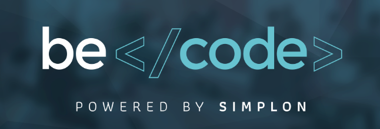

## Qui suis-je?

Autodidacte et développeur Web j’ai créé deux sites internet.

Soucieux de mieux maitriser le langage de développeur, je me suis orienté vers la formation proposée par Becode.org, organisation non-scolaire. Cette formation me correspond bien ; l’apprentissage des différents langages web se fait via la création de tâches en groupe.

Je suis, à ce jour, capable de coder correctement en MARKDOWN, HTML , CSS (BOOTSTRAP, MEDIA QUERIES, REPSONSIVE), JAVASCRIPT (JQUERY), PHP ; je peux également travailler avec Github et ses outils.

Le travail en groupe m’a permis d’apprendre le respect du travail et des idées de l’autre.

MAIS, assez parlé !!! Il est temps de découvrir mon travail.



### Mes créations de website
Mes travaux actuels (pendant ma formation chez Becode en 2017)

J’ai pu acquérir les bonnes manières de coding HTML, CSS.

Sur ce repo, vous pouvez découvrir tous les exercices faits lors de ma formation

Ci-dessous, la liste des travaux généralises :

1. [Un Site Bootstrap pour un restaurant de sushis](https://rivanos.github.io/project-site-bootstrap--Sushi-House/)
2. [Un Site Front-end sur le thème du Cinéma](https://rivanos.github.io/TI-FrontEnd-AllezCine/)
3. [Un site pour enfant Front-end](https://rivanos.github.io/TI-FrontEnd-AllezCine/site/index.html)
4. Une Newsletter sans erreur sur Gmail, Yahoo, outlook 2003, Thunderbird 2, Windows Live Mail, et dont une optimisation pour mobile doit encore être pensé.

Dans le cadre de la formation nous concevons un site internet pour un client. ConnectBX est une association qui regroupe toutes les autres associations de Bruxelles permettant aux jeunes de pouvoir trouver l'association de leur choix dans laquelle faire du Bénévolat.

Il s'agit d'un travail de groupe. Je suis le Git Master du groupe et le site est concu en PHP bootstrapé. [Repo](https://github.com/Rivanos/projet-client-connectbx)


Mes créations de Website (avant ma formation chez Becode en 2016):
1. [Sambodha Asbl] En cours de refonte graphique (http://www.sambodha.be/)
2. [Zen@home] En cours de refonte graphique (http://www.zenhome.sambodha.be/)
3. [Catalogue de Zen@home](http://www.zenhome.sambodha.be/Ecommerce/)

-----------------
```

<h1>Programmer :</h1>
  <p>Machine that turns coffee into code</p>

```

### Mes créations de PHP

J'ai aussi créer une [fonction de pagination](https://github.com/Rivanos/Function_Pagination) en PHP

-----------------

## Mes attentes

Lors de la création du site internet de mon asbl, j’ai découvert le monde du coding et j’ai vraiment pris mon pied (ou si vous trouvez plus poli : j’ai pris beaucoup de plaisir) en découvrant le monde du coding.

Je souhaiterai pouvoir développer mes compétences actuelles en codage par l’apprentissage de nouveaux langages de programmation et, plus particulièrement, me spécialiser dans un langage qui me plairait tant par sa complexité que par sa beauté.

J’aimerai également pouvoir travailler sur un projet intéressant à travers lequel je pourrai avancer tant professionnellement que personnellement.

Merci de m’avoir lu jusqu’au bout. Michaël 
